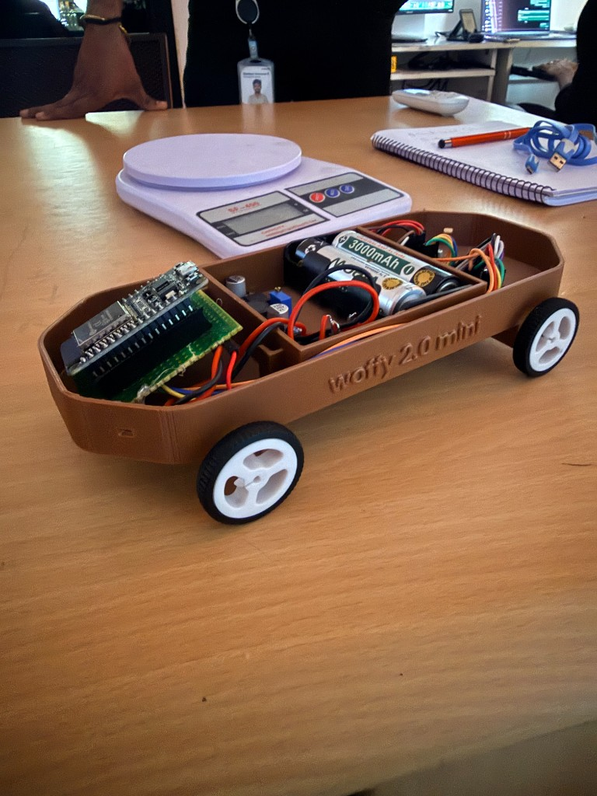
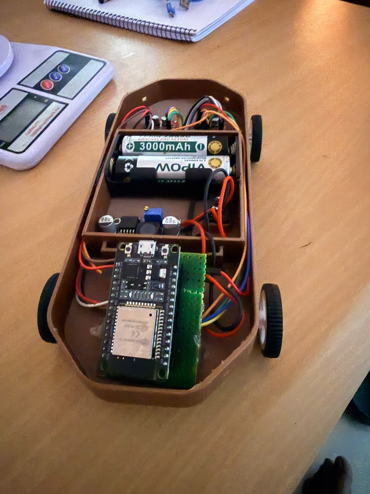
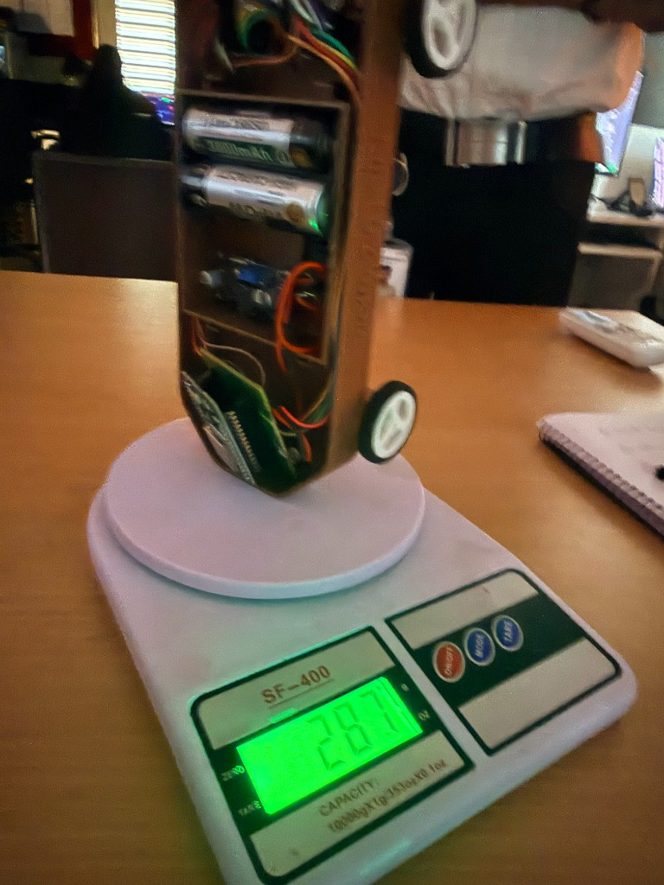

# Woffy 2.0 Mini — L293D 4WD + Wi-Fi Control

ESP32 + 2x L293D + 4x N20 motors. Drive from your phone over Wi-Fi or test via serial.

## The Robot

| Side View | Top View | Weight |
|-----------|----------|--------|
|  |  |  |

- **Chassis:** 3D printed body with "woffy 2.0 mini" embossed
- **Weight:** ~287g (fully loaded with batteries)

---

## Hardware

- ESP32 DevKit (ESP-WROOM-32)
- 2x L293D motor drivers (front + rear)
- 4x N20 6V 300RPM gear motors
- 2x 18650 3000mAh batteries (7.4V) — L293D drops ~1.4V → ~6V at motors
- White spoke wheels with rubber tires

---

## Circuit Diagram

### Wiring Overview


```
                    ┌──────────────┐
                    │   BATTERY    │
                    │  2x 18650    │
                    │   7.4V       │
                    │              │
                    │  (+) ───┬──── L293D #1 [VCC2]
                    │         └──── L293D #2 [VCC2]
                    │              │
                    │  (-) ───┬──── L293D #1 [GND]
                    │         ├──── L293D #2 [GND]
                    │         └──── ESP32 [GND]
                    └──────────────┘
```

### ESP32 → L293D #1 (Front Motors)

```
ESP32                L293D #1                 Motors
─────                ────────                 ──────
GPIO 25 ──────────── IN1 (A1) ┐
                               ├── OUT A ──── Front-Left Motor
GPIO 26 ──────────── IN2 (A2) ┘

GPIO 27 ──────────── IN3 (B1) ┐
                               ├── OUT B ──── Front-Right Motor
GPIO 14 ──────────── IN4 (B2) ┘

                     EN A ─── 7.4V (always on)
                     EN B ─── 7.4V (always on)
                     VCC1 ─── 5V (logic)
                     VCC2 ─── 7.4V (motor power)
                     GND ──── Common GND
```

### ESP32 → L293D #2 (Rear Motors)

```
ESP32                L293D #2                 Motors
─────                ────────                 ──────
GPIO 18 ──────────── IN1 (A1) ┐
                               ├── OUT A ──── Rear-Left Motor
GPIO 19 ──────────── IN2 (A2) ┘

GPIO 21 ──────────── IN3 (B1) ┐
                               ├── OUT B ──── Rear-Right Motor
GPIO 22 ──────────── IN4 (B2) ┘

                     EN A ─── 7.4V (always on)
                     EN B ─── 7.4V (always on)
                     VCC1 ─── 5V (logic)
                     VCC2 ─── 7.4V (motor power)
                     GND ──── Common GND
```

### Motor Placement (Top View)


---

## Movement Logic


---

## Speed Reference

| PWM | Duty % | Approx RPM |
|-----|--------|------------|
| 120 | 47%    | ~140 RPM   |
| 150 | 59%    | ~175 RPM   |
| **180** | **70%** | **~210 RPM (default)** |
| 200 | 78%    | ~235 RPM   |
| 255 | 100%   | ~300 RPM   |

---

## Setup

1. Open `woffy_mx1508/` in Arduino IDE
2. Board: **ESP32 Dev Module**
3. Upload

---

## Phone Control


1. Connect phone to **Woffy2** Wi-Fi (password: `woffy1234`)
2. Open **http://192.168.4.1**
3. **D-pad:** hold to drive, release to stop
4. **Multi-touch:** hold forward + tap left/right to curve
5. **Speed slider:** drag to adjust PWM (60–255)
6. **Test buttons:** tap to run motor tests

---

## Serial Commands

Open serial monitor at 115200 baud:

| Command | Action |
|---------|--------|
| `fwd`   | All motors forward |
| `bwd`   | All motors backward |
| `left`  | Spin left |
| `right` | Spin right |
| `stop`  | Stop all |
| `test`  | Run all 5 tests |
| `test1` | Individual motor spin (fwd + rev) |
| `test2` | Direction verification |
| `test3` | Speed sweep (slip detection) |
| `test4` | AKASH original motor check |
| `test5` | Figure-8 pattern |

---

## Files

```
woffy2.0/
├── README.md
├── images/
│   ├── woffy_side_view.png      — robot side photo
│   ├── woffy_top_view.png       — robot top/internals photo
│   ├── woffy_weight.png         — weight on scale (287g)
│   ├── woffy_wiring_diagram.png — full wiring schematic
│   ├── woffy_motor_placement.png— motor layout diagram
│   ├── woffy_movement_logic.png — movement command reference
│   └── woffy_web_ui.png         — phone control UI mockup
└── woffy_mx1508/
    ├── woffy_mx1508.ino   — main (Wi-Fi + server + serial + tests)
    ├── motors.h           — L293D motor control (8 PWM pins)
    ├── config.h           — Wi-Fi AP SSID/password
    └── html.h             — phone UI (D-pad + slider + tests)
```
